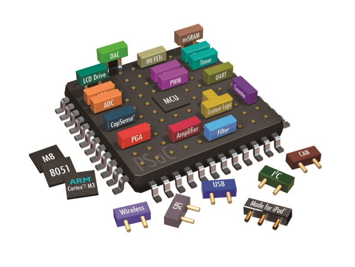
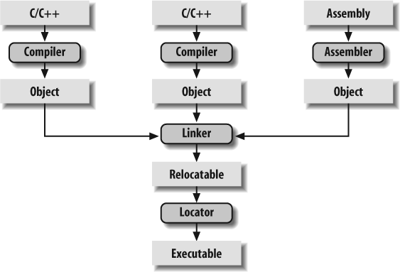
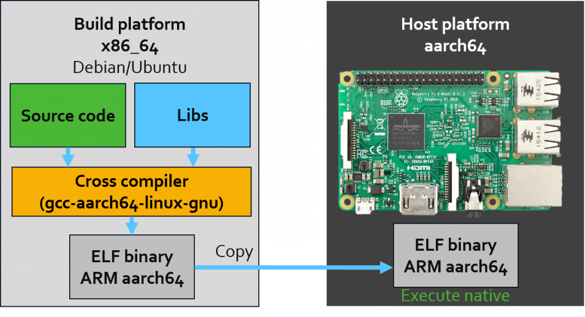

## 임베디드 운영체제

- 운영체제는 하드웨어를 관리하고 응용 소프트웨어를 실행하기 위한 공통 시스템 서비스 소프트웨어이다.
- 이 중 기기에 탑재돼 해당 기기의 실행과 관리를 위해 운영되는 것이 서비스 실행용 임베디드 운영체제에 속한다.
- 모바일 기기에 사용되는 스마트폰, 전자책, 스마트워치를 비롯해 자동차, 냉장고 등에 탑재된 운영체제가 여기에 속한다.

## 임베디드 시스템이란?

- 어떤 형태로든 제어가 필요한 하드웨어에 대해, 제어를 위한 기능을 수행해 주는 소프트웨어가 탑재된 모든 것들을 뜻한다.
- 특정 기기에 맞게, 한 기기만을 위해 만들어진 프로그램들이 대부분이다.
  - 기술 발전에 따라 임베디드 시스템과 PC간의 경계가 모호해지는 부분들이 있다. 대표적인 예시로는 스마트폰이 그 예이다.
  - 라즈베리파이 또한 임베디드 시스템에 속하나 상황에 따라 PC로도 사용할 수 있는 초소형 컴퓨터이다.

## 임베디드 프로그래밍

- 프로그램이 만들어지는 과정에서 컴파일과 링킹 과정은 다음과 같다.

- 각 소스들을 컴파일하여 링커가 오브젝트 파일을 합쳐서 최종적으로 프로그램을 만들어 낸다.
- 하지만 이 컴파일 과정에서 일반적으로 컴파일 하는 기기 기준으로 프로그램이 만들어지기 때문에 해당 기기와 다른 아키텍처를 가지는 기기에서는 프로그램을 실행할 수 없다. 따라서 임베디드 시스템에 올라가는 프로그램을 작성하기 위해선 다른 방법이 필요하다.

- 임베디드 시스템에 필요한 프로그램을 작성하기 위해선 아래 그림과 같이 "Cross-compile" 같은 개발 플랫폼을 가진다.

- 타겟 기기에 동작시킬 프로그램을 다른 하드웨어 아키텍처에서 개발하여 프로그램을 올리는 방식이다.

- 일반적인 PC(개발용 PC)들은 x86_64 아키텍처를 가지고 있으므로 타겟으로 하는 기기가 아키텍처가 다른 경우(aarch64) 이것을 고려하여 컴파일러가 해당 기기에 맞게 프로그램을 컴파일 해준다.

- 이러한 크로스 컴파일 개발환경은 툴 레벨에서 지원하는 곳들도 많다.

  - Design_Studio
  - Keil
  - ...

  

