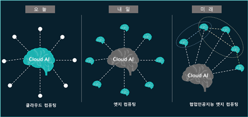

### AI Edge Computing이란?

- Edge단에서 AI 컴퓨팅이 수행되는 것을 의미
- 미래에는 인공지능을 갖고 있는 엣지들이 서로 협업하여 **엣지 각각의 프라이빗 목적을 수행하면서 공공의 목적을 달성하기 위해 동작하는 협업 AI 엣지 컴퓨팅**으로 발전할 것으로 기대됨

### AI Edge Computing의 필요성

- 클라우드 컴퓨팅에 비해 **지연시간** **(latency)**이 짧고 해킹 가능성이 낮으며 광범위한 이동성을 지원할 수 있다는 점에서 강점
- 장치에서 직접 AI, 빅데이터 등 컴퓨팅이 수행됨으로써 **네트워크에 대한 의존도를 상대적으로 크게 낮출 수 있는 기술**로 평가
- IoT 장치가 확산되고 실용화됨에 따라 **실시간으로 막대한 양의 데이터를 저장하고**, **효율적으로 전송하고**, **처리할 수 있는 능력이 필수**

