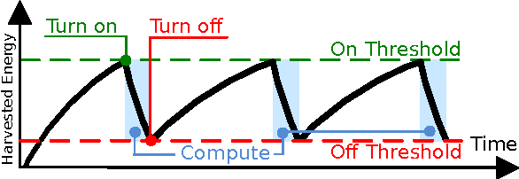
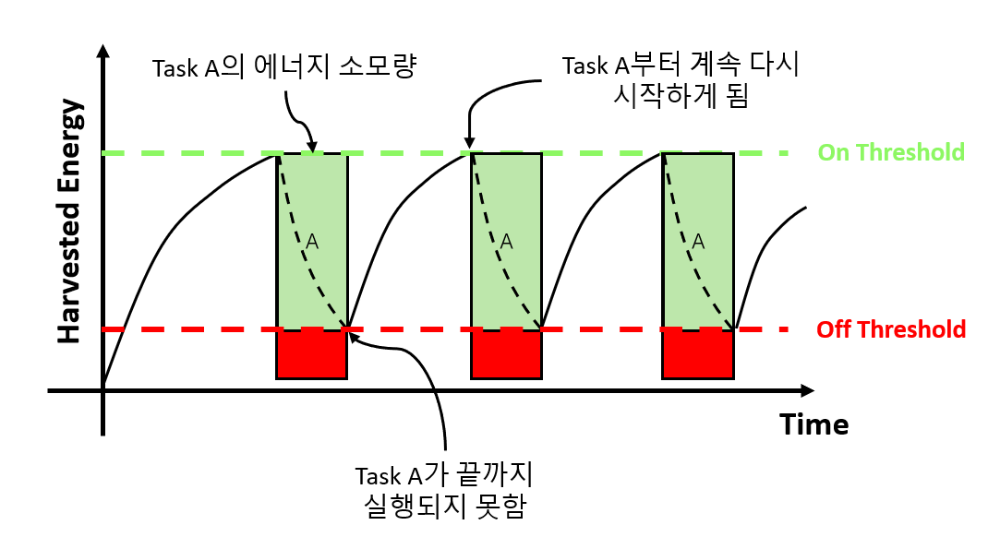

<h3> 인터미턴트 컴퓨팅(Intermittent Computing)란? </h3>

-----------

* <h4>에너지 하베스팅(Energy Harvesting)을 통해 적절한 에너지 레벨을 넘어서면 컴퓨팅이 진행되고 이후 에너지가 소모되어 특정 이하의 에너지 레벨이 되면 컴퓨팅이 중지하고 에너지를 다시 충전하게 되는 프로세스를 반복</h4>

<h3> 기존 시스템과의 차이점 </h3>

------

* <h4>기존 시스템의 경우 에너지 공급이 중단되면 실행 중인 모든 정보가 소실되고 에너지 공급이 재개될 경우 초기화 과정부터 다시 진행을 해야 하므로 실행의 연속성을 보장할 수 없음</h4>

|                                | 기존 임베디드 시스템                                         | 인터미턴트 컴퓨팅 시스템                                     |
| ------------------------------ | ------------------------------------------------------------ | ------------------------------------------------------------ |
| 에너지 공급환경 및 시스템 동작 | - 에너지의 공급이 무한정이라고 가정 - 전원 케이블에 의해 항상 에너지가 확보되어 있음 | - 불규칙적인 에너지 공급 - 에너지 하베스터 모듈을 통해 일정 이상의 에너지가 확보되면 시스템이 켜지고 동작 - 에너지가 모두 사용되면 에너지 하베스터 모듈에 의해 에너지를 확보할 때까지 시스템 꺼짐 |
| 소프트웨어 프로그래밍 기법     | - 프로그래머가 에너지 사용에 대해 고려할 필요성이 없음       | - 확보된 에너지가 모두 고갈되면 시스템이 꺼지므로 에너지 소모를 고려한 프로그래밍이 요구됨 - 에너지가 모두 소모되기 전, 휘발성 데이터를 비휘발성 메모리로 이동시키는 작업을 프로그래머가 해주어야 함 |

<h3> 어떻게 구현되는가? </h3>

--------

* <h4>일반적인 방법으로 개발자가 프로그램 소스코드 중간에 적절히 "체크포인트"를 삽입하여 만들게 됨</h4>

* <h4>체크포인트는 휘발성 메모리의 데이터를 비휘발성 메모리에 백업하고 시스템이 정지하고 다시 동작하게 될 때 해당 백업 데이터를 다시 복구하고 그 시점부터 다시 동작하는 루틴을 가짐</h4>
* <h4>프로그래머가 직접 체크포인트를 삽입하여야 하므로 타겟 하드웨어에 대한 지식도 필수적이므로 숙련된 개발자가 아닐 경우 비효율적인 소프트웨어를 만들게 될 수 있음 (아래 예시 그림)</h4>

<h3>현재 연구</h3>

-------

* <h4>체크포인트 루틴을 프로그래머가 아닌 컴파일 단계에서 자동 생성 및 삽입 연구</h4>

* <h4>시스템의 잔여 에너지량을 고려하여 체크포인트 실행 여부를 결정하는 런타임 체크포인트 활성화 기법 연구</h4>

